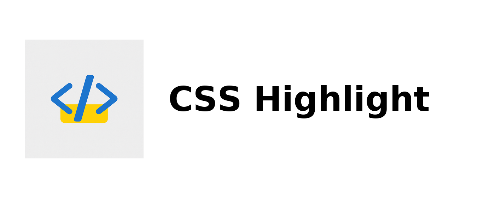

# CSS Highlight — Chrome Extension

Quickly highlight elements on a webpage that match a term. Perfect for developers and designers inspecting layouts and styles. Privacy-friendly and lightweight.

## Features

* Highlight elements by search term
* Instant visual feedback directly on the page
* Simple popup UI
* Runs fully local (no data collection)

## Installation (Developer Mode)

1. Clone the repository
   Run: git clone [https://github.com/viguza/css-highlight.git](https://github.com/viguza/css-highlight.git)
2. Open Chrome and go to: chrome://extensions/
3. Enable **Developer mode** (top-right)
4. Click **Load unpacked** and select the project folder

## Usage

1. Click the extension icon in the Chrome toolbar
2. Enter a selector
   Examples: .class-name, #element-id
3. Press **Apply** to highlight matches
4. Press **Clear** to remove the highlights

Tips:

* Use simple selectors for best results
* If nothing highlights, verify the selector exists on the current page

## Project Structure

* background/ — background service worker (events/bridge)
* content/ — content script injected into pages to apply highlights
* popup/ — popup UI where you enter selectors
* icons/ — extension icons
* manifest.json — Chrome Manifest V3 configuration
* LICENSE — project license

## Development

* Adjust highlight styles (borders, outline, background) in the content/ scripts
* Improve the popup UI in popup/
* After changes, go to chrome://extensions/ and click **Reload** on the extension

## Quick Test

* Open any content-heavy website (e.g., a news site or blog)
* Try selectors like: .btn, .card, .nav, .container and #header, #footer
* Confirm all matching elements are highlighted

## Contributing

1. Fork the repository
2. Create a branch: feat/my-feature
3. Open a pull request with a clear description and screenshots if UI-related

## License

MIT — see the LICENSE file for details

## Credits

Built to simplify CSS debugging by instantly highlighting DOM elements using Chrome’s Manifest V3 extension architecture.
