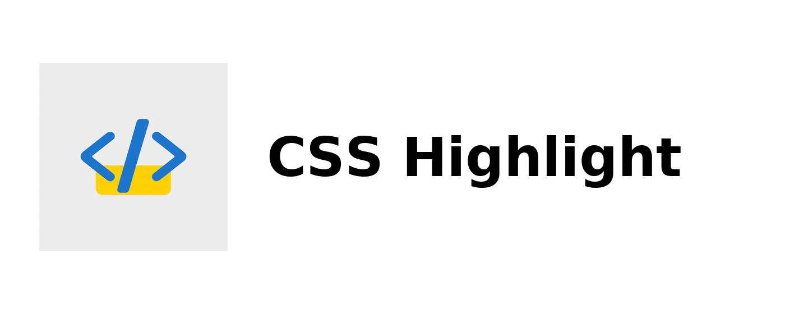

# CSS Highlight — Chrome Extension

Find and highlight any element on a webpage by **text content**, **attribute**, or **CSS selector** — instantly, without opening DevTools.

Built for developers and QA engineers who need to quickly locate elements on a live page: verify a label is rendered, check which elements share a class, or find every `data-testid` attribute at a glance.

## Why this exists

Chrome DevTools is powerful but slow to open and navigate when you just want a quick answer. CSS Highlight gives you that answer in one click.

## Features

- **Text content search** — find elements by what they say (e.g. "Sign Up", "Submit")
- **Attribute search** — find by `data-testid`, `aria-label`, or any custom attribute, with optional value filtering
- **CSS selector** — full querySelector support for precise targeting
- **Class and ID** — quick lookups for the common cases
- Multiple highlight styles: background, border, outline, underline, box shadow
- Adjustable color and opacity
- Element navigation with scroll-to and count display
- Runs fully local — no data collection, no network requests

## Installation (Developer Mode)

1. Clone the repository: `git clone https://github.com/viguza/css-highlight.git`
2. Open Chrome and go to `chrome://extensions/`
3. Enable **Developer mode** (top-right toggle)
4. Click **Load unpacked** and select the project folder

## Usage

1. Click the extension icon in the Chrome toolbar
2. Choose a search type from the dropdown
3. Enter your search term
4. Press **Highlight** — matched elements are highlighted on the page
5. Use the navigation arrows to step through results
6. Press **Reset** to clear all highlights

### Example use cases

- QA: Find every `[data-testid="submit-btn"]` to verify test selectors are in place
- Dev: Check which elements share a class after a refactor
- Anyone: Find every element that contains the text "Free Trial" on a marketing page

## Project structure

```
background/   — service worker (message bridge)
content/      — content script injected into pages
popup/        — popup UI (HTML, JS, CSS)
icons/        — extension icons
manifest.json — Chrome Manifest V3 config
```

## Contributing

1. Fork the repository
2. Create a branch: `feat/my-feature`
3. Open a pull request with a clear description and screenshots for UI changes

## License

MIT — see the LICENSE file for details.
